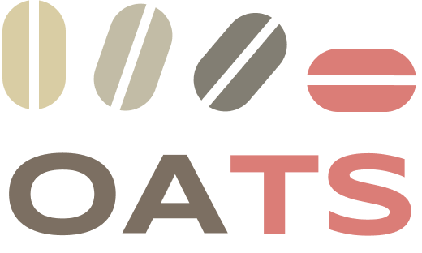

<!-- Improved compatibility of back to top link: See: https://github.com/othneildrew/Best-README-Template/pull/73 -->
<a name="readme-top"></a>
<!--
*** Thanks for checking out the Best-README-Template. If you have a suggestion
*** that would make this better, please fork the repo and create a pull request
*** or simply open an issue with the tag "enhancement".
*** Don't forget to give the project a star!
*** Thanks again! Now go create something AMAZING! :D
-->


<!-- PROJECT SHIELDS -->
<!--
*** I'm using markdown "reference style" links for readability.
*** Reference links are enclosed in brackets [ ] instead of parentheses ( ).
*** See the bottom of this document for the declaration of the reference variables
*** for contributors-url, forks-url, etc. This is an optional, concise syntax you may use.
*** https://www.markdownguide.org/basic-syntax/#reference-style-links
-->
[![Contributors][contributors-shield]][contributors-url]
[![Forks][forks-shield]][forks-url]
[![Stargazers][stars-shield]][stars-url]
[![Issues][issues-shield]][issues-url]
[![Apache 2.0 License][license-shield]][license-url]


<!-- PROJECT LOGO -->
<br />
<div align="center">
  <a href="https://github.com/georgian-io/oats">
    
  </a>

<h3 align="center"> OATS</h3>

  <p align="center">
    Quick and Easy Outlier Detection for Time Series 
    <br />
    <a href="https://github.com/georgian-io/oats"><strong>Explore the docs »</strong></a>
    <br />
    <br />
    <a href="https://github.com/georgian-io/oats">View Demo</a>
    ·
    <a href="https://github.com/georgian-io/oats/issues">Report Bug</a>
    ·
    <a href="https://github.com/georgian-io/oats/issues">Request Feature</a>
  </p>
</div>


<!-- TABLE OF CONTENTS -->
<details>
  <summary>Table of Contents</summary>
  <ol>
    <li>
      <a href="#about-the-project">About The Project</a>
      <ul>
        <li><a href="#built-with">Built With</a></li>
      </ul>
    </li>
    <li>
      <a href="#getting-started">Getting Started</a>
      <ul>
        <li><a href="#prerequisites">Prerequisites</a></li>
        <li><a href="#installation">Installation</a></li>
      </ul>
    </li>
    <li><a href="#usage">Usage</a></li>
    <li><a href="#models">Models</a></li>
    <li><a href="#roadmap">Roadmap</a></li>
    <li><a href="#contributing">Contributing</a></li>
    <li><a href="#license">License</a></li>
    <li><a href="#contact">Contact</a></li>
    <li><a href="#acknowledgments">Acknowledgments</a></li>
  </ol>
</details>


<!-- ABOUT THE PROJECT -->
## About The Project
Current
* Implementation of anomaly detection models for 
* Novel, SOTA models
* Modular design for 


<p align="right">(<a href="#readme-top">back to top</a>)</p>


### Built With
* [![Poetry][Python-Poetry.org]][Poetry-url]
* [![Python][Python.org]][Python-url]
* [![Pytorch][Pytorch.org]][Torch-url]
* [![TensorFlow][TensorFlow.org]][TF-url]
* [![Numpy][Numpy.org]][Numpy-url]
* [![Darts][Darts]][Darts-url]
* [![PyOD][PyOD]][PyOD-url]

<p align="right">(<a href="#readme-top">back to top</a>)</p>


<!-- GETTING STARTED -->
## Getting Started

This is an example of how you may give instructions on setting up your project locally.
To get a local copy up and running follow these simple example steps.

### Prerequisites

This is an example of how to list things you need to use the software and how to install them.
*  [![Python][Python.org]][Python-url] >= 3.8

### Installation
#### PyPI
1. Install package via pip
   ```sh
   pip install oats
   ```
  
#### Docker
1. Clone the repo
   ```sh
   git clone https://github.com/georgian-io/oats.git && cd oats 
   ```
 2. Build image
   ```sh
   docker build -t one . 
   ```


 4. Run container
  
#### Local
1. Clone the repo
   ```sh
   git clone https://github.com/georgian-io/oats.git && cd oats 
   ```
  1. Install via Poetry
	   ```sh 
	   poetry install
	   ```

<p align="right">(<a href="#readme-top">back to top</a>)</p>


<!-- USAGE EXAMPLES -->
## Usage

Use this space to show useful examples of how a project can be used. Additional screenshots, code examples and demos work well in this space. You may also link to more resources.

_For more examples, please refer to the [Documentation](https://example.com)_

<p align="right">(<a href="#readme-top">back to top</a>)</p>

<!-- Models -->
## Models


_For more details about the individual models, please refer to the [Documentation](https://example.com)_

Model | Type | Multivariate Support | DL Dependency | Paper | Reference Model
--- | --- | --- | --- | --- | --- 
`N-BEATS` | Predictive | ✅ | [![Pytorch][Pytorch.org]][Torch-url] | [📝](https://github.com/Nixtla/statsforecast) | [Darts-NBEATS](https://github.com/Nixtla/statsforecast)
`N-BEATS` | Predictive | ⚠️ | [![Pytorch][Pytorch.org]][Torch-url] | [📝](https://github.com/Nixtla/statsforecast) | [Darts-NBEATS](https://github.com/Nixtla/statsforecast)


<p align="right">(<a href="#readme-top">back to top</a>)</p>


<!-- ROADMAP -->
## Roadmap

- [ ] Automatic hyper-parameter tuning
- [ ] Better documentation 
- [ ] More preprocessors for timeseries

See the [open issues](https://github.com/georgian-io/oats/issues) for a full list of proposed features (and known issues).

<p align="right">(<a href="#readme-top">back to top</a>)</p>


<!-- CONTRIBUTING -->
## Contributing

Contributions are what make the open source community such an amazing place to learn, inspire, and create. Any contributions you make are **greatly appreciated**.

If you have a suggestion that would make this better, please fork the repo and create a pull request. You can also simply open an issue with the tag "enhancement".
Don't forget to give the project a star! Thanks again!

1. Fork the Project
2. Create your Feature Branch (`git checkout -b feature/amazing_feature`)
3. Commit your Changes (`git commit -m 'Add some amazing_feature'`)
4. Push to the Branch (`git push origin feature/amazing_feature`)
5. Open a Pull Request

<p align="right">(<a href="#readme-top">back to top</a>)</p>


<!-- LICENSE -->
## License

Distributed under the Apache 2.0 License. See `LICENSE` for more information.

<p align="right">(<a href="#readme-top">back to top</a>)</p>


<!-- CONTACT -->
## Contact

<div align="left">
  <a href="https://www.georgian.io">
    
  </a>


|<!-- -->|<!-- -->|<!-- -->|
|---|---|---|
| __Benjamin Ye__ |  [![LinkedIn][LinkedIn]][BenLinkedIn-url] |  [![eMail][eMail]][BenEmail-url] 


Project Link: [https://github.com/georgian-io/oats](https://github.com/georgian-io/oats)

<p align="right">(<a href="#readme-top">back to top</a>)</p>


<!-- ACKNOWLEDGMENTS -->
## Acknowledgments
Colleagues from Georgian:
* [Angeline Yosodara](mailto:angeline@georgian.io)

<p align="right">(<a href="#readme-top">back to top</a>)</p>


<!-- MARKDOWN LINKS & IMAGES -->
<!-- https://www.markdownguide.org/basic-syntax/#reference-style-links -->
[contributors-shield]: https://img.shields.io/github/contributors/georgian-io/oats.svg?style=for-the-badge
[contributors-url]: https://github.com/georgian-io/oats/graphs/contributors
[forks-shield]: https://img.shields.io/github/forks/georgian-io/contributors.svg?style=for-the-badge
[forks-url]: https://github.com/georgian-io/oats/network/members
[stars-shield]: https://img.shields.io/github/stars/georgian-io/oats.svg?style=for-the-badge
[stars-url]: https://github.com/georgian-io/oats/stargazers
[issues-shield]: https://img.shields.io/github/issues/georgian-io/oats.svg?style=for-the-badge
[issues-url]: https://github.com/georgian-io/oats/issues
[license-shield]: https://img.shields.io/github/license/georgian-io/oats.svg?style=for-the-badge
[license-url]: https://github.com/georgian-io/oats/blob/master/LICENSE
[linkedin-shield]: https://img.shields.io/badge/-LinkedIn-black.svg?style=for-the-badge&logo=linkedin&colorB=555
[linkedin-url]: https://ca.linkedin.com/company/georgian
[product-screenshot]: images/screenshot.png


<!-- Deps Links -->
[Python-Poetry.org]: https://img.shields.io/badge/Poetry-60A5FA?style=for-the-badge&logo=poetry&logoColor=white
[Poetry-url]: https://www.python-poetry.org/
[Python.org]: https://img.shields.io/badge/Python-3776AB?style=for-the-badge&logo=python&logoColor=white
[Python-url]: https://www.python.org/
[PyTorch.org]: https://img.shields.io/badge/PyTorch-EE4C2C?style=for-the-badge&logo=pytorch&logoColor=white
[Torch-url]: https://pytorch.org/
[TensorFlow.org]: https://img.shields.io/badge/TensorFlow-FF6F00?style=for-the-badge&logo=tensorflow&logoColor=white
[TF-url]: https://www.tensorflow.org/
[Numpy.org]: https://img.shields.io/badge/Numpy-013243?style=for-the-badge&logo=numpy&logoColor=white
[Numpy-url]: https://www.numpy.org/
[Darts]: https://img.shields.io/badge/Repo-Darts-2100FF?style=for-the-badge&logo=github&logoColor=white
[Darts-url]: https://github.com/unit8co/darts
[PyOD]: https://img.shields.io/badge/Repo-PyOD-000000?style=for-the-badge&logo=github&logoColor=white
[PyOD-url]: https://github.com/yzhao062/pyod


[LinkedIn]: https://img.shields.io/badge/LinkedIn-0A66C2?style=for-the-badge&logo=linkedin&logoColor=white
[BenLinkedIn-url]: https://www.linkedin.com/in/benjaminye/


[eMail]: https://img.shields.io/badge/EMail-EA4335?style=for-the-badge&logo=gmail&logoColor=white
[BenEmail-url]: mailto:benjamin.ye@georgian.io
